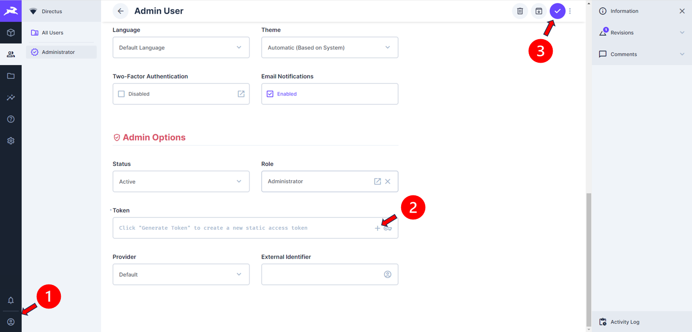

# Bus Data Collection
A mini project to collect data for selected bus services using Directus

# Motivation

I am very interested in bus services in Singapore. I am curious about the arrival time of certain bus services during Weekdays, Saturdays, Sundays and Public Holidays, and whether there are any significant difference in each of them. I am also curious about the operations during eve of public holidays, when bus operating hours are extended late in the night for some services.

The data collected will be used for data analysis in the future.

The following are also achieved in this project:
- Using Directus backed by SQLite
- Running cronjobs in Docker containers

# Pre-requisite

- Docker Compose
- API Key for access to LTA Datamall.
    - You may request for one [here](https://datamall.lta.gov.sg/content/datamall/en/request-for-api.html).

# Installation

1. Clone this repository
2. Rename `env-sample` to `.env`
3. Populate the following fields
    - `ADMIN_EMAIL`: Your preferred Directus Username
    - `ADMIN_PASSWORD`: Your preferred Directus Password
    - `KEY`: Run `cat /proc/sys/kernel/random/uuid` (Linux) or `powershell -Command "[guid]::NewGuid().ToString()"` (Powershell) and copy the generated text
    - `SECRET`: Repeat the step to generate `KEY`. You should get a different text.
    - `TOKEN`: Leave it untouched for now
    - `ACCOUNT_KEY`: API Key for access to LTA Datamall
4. Run `docker compose up -d`
5. Go to `http://localhost:8055`
6. Log in to Directus using `ADMIN_EMAIL` and `ADMIN_PASSWORD`
7. Follow the following steps to generate your token
    - Click on "Admin User" icon on the bottom left
    - Scroll to the bottom and click the "+" sign under "Token". Copy the generated token (**Important!**)
    - Click on the "Tick" icon to save
    - Go to `.env` file and populate the `TOKEN` field with the newly generated token.

8. Run `docker compose up --build -d` again.
9. To verify if your program is running, lookout for a file named in the form `logs_YYYY-MM-DD.txt` in `logs` folder which contains all captured information.

## How to customize bus services to be tracked

1. Go to `src/config/bus_config.py`
2. You will see the following variables:
    - `SUNDAY_PH_BUS`: Buses to track on Sundays and Public Holidays
    - `SAT_BUS`: Buses to track on Saturdays
    - `WEEKDAY_BUS`: Buses to track on Weekdays (except Public Holidays)
    - `PH_EVE_BUS`: Buses to track on Eve of Public Holidays
    (*Public Holiday has priority over all other days*)
3. To track new bus stops and bus services, add a pair `(<bus_stop_code>, <bus_service>)` into the corresponding variable's key `"bus_stop": []`
    - For example: `('48111', '138A')` tracks bus 138A at bus stop code `48111`
    **Do not remove, add or change the name of any of the constant variables in the file!**
    - To stop tracking buses on a particular category, simply remove all the `(<bus_stop_code>, <bus_service>)` pair in the corresponding variable.

## How to update list of Public Holidays

The list of public holiday have to be updated in `src/config/public_holiday.py` whenever Ministry of Manpower updated the dates for public holidays in Singapore.

This is because the program refers to this file to determine if the current date is a public holiday or not.

[List of Public Holidays](https://www.mom.gov.sg/employment-practices/public-holidays)

# Credits
- Land Transport Authority of Singapore (LTA) for providing access to its bus service API (LTA Datamall)
- Ministry of Manpower (for public holidays)